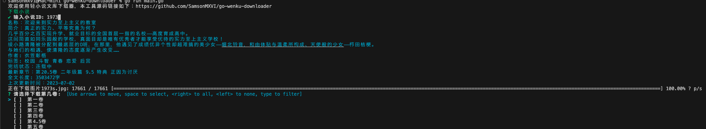
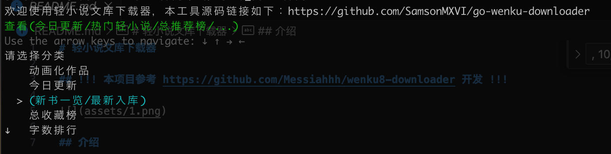
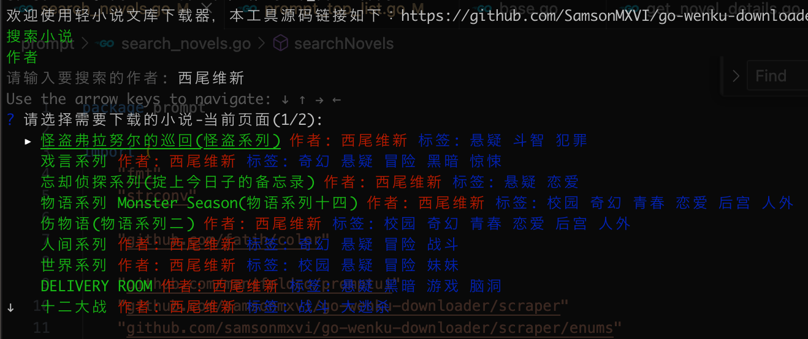

# 轻小说文库下载器

## !!! 本项目参考 https://github.com/Messiahhh/wenku8-downloader 开发 !!!



## 介绍

本工具可用来下载[轻小说文库](https://www.wenku8.net/index.php)的小说，支持以下功能

- 支持生成*epub*格式的电子书
- 支持下载轻小说文库站点已下架的小说，如《无职转生》
- 支持通过(小说名/作者名)搜索小说
- 支持通过(热门小说/总收藏榜/动画化作品/等等)分类查询

## 使用方法(Window/MacOS/Linux)

[Release 下载](https://github.com/SamsonMXVI/go-wenku-downloader)

> windows 直接运行 exe 即可

```shell
chmod +x wenku_downloader
./wenku_downloader
```

## 效果图






## 贡献者

<a href="https://github.com/SamsonMXVI/go-wenku-downloader/graphs/contributors">
  
</a>

## wenku8-downloader 项目贡献者～非常感谢～

<a href="https://github.com/Messiahhh/wenku8-downloader/graphs/contributors">
  
</a>
